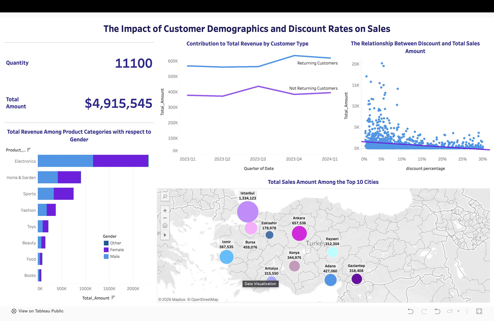

# The Impact of Customer Demographics and Discount Rates on Sales

## Project Overview
This project analyzes sales performance across various product categories and cities in Turkey. The primary goal is to decipher the relationship between customer demographics, discount strategies, and total revenue using data-driven visualizations.

### Key Performance Indicators (KPIs)
| Metric | Value |
| :--- | :--- |
| **Total Revenue** | $4,915,545 |
| **Total Quantity Sold** | 11,100 units |
| **Top Performing City** | Istanbul ($1.3M+) |

## Project Files
* **[View Full Presentation Slides (PDF)](./research-presentation.pdf)** – Detailed economic research findings.
* **[Download Tableau Workbook (.twbx)](./project-analysis.twbx)** – Interactive dashboard file.

## Visualizations & Strategic Insights
1. **Geographic Distribution:** Map analysis identifying Istanbul and Ankara as primary revenue hubs.
2. **Product Segmentation:** Category-wise sales performance filtered by gender demographics.
3. **Temporal Trends:** Time-series analysis (Jan 2023 - Jan 2024) comparing different customer segments.
4. **Discount Impact:** A scatter plot analysis identifying the correlation between **Discount Percentage** and **Sales Volume**.

## Tools & Tech Stack
* **Tableau:** Dashboard design, calculated fields, and geospatial analysis.
* **Data Source:** Turkey Sales Dataset (2023-2024).

---
**Authors:** Eylül Uysal & The Statistics Research Group (4 members) 
